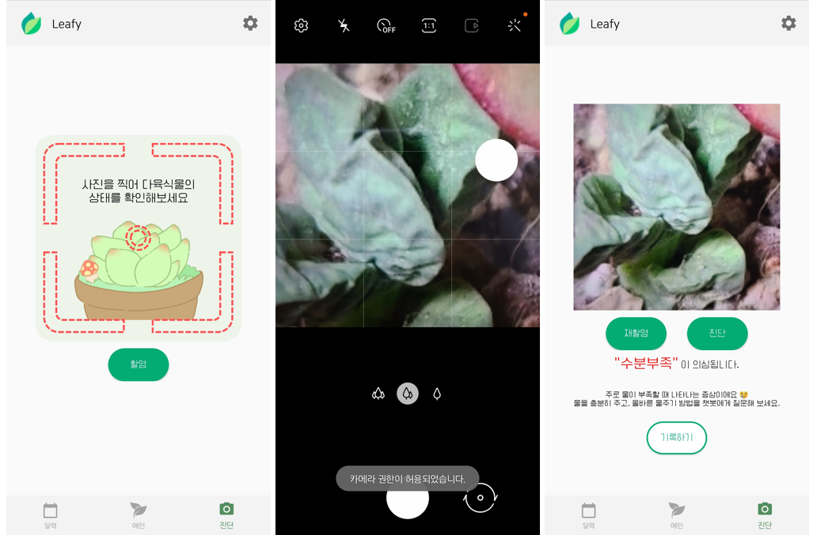
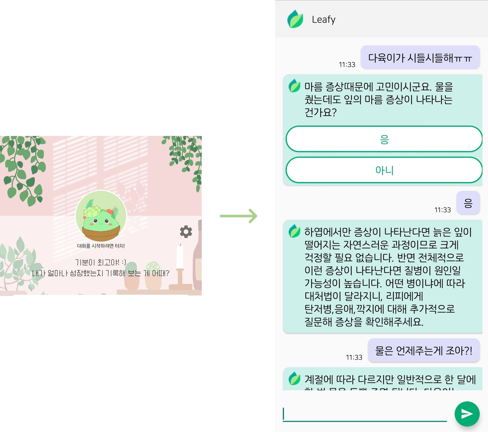
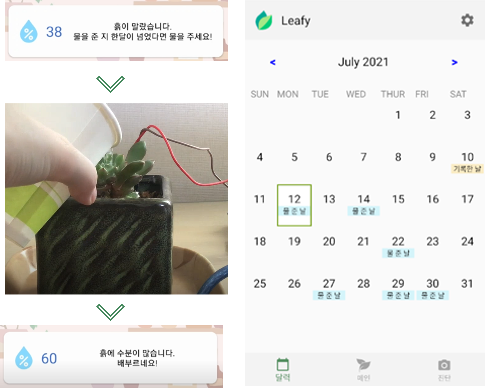
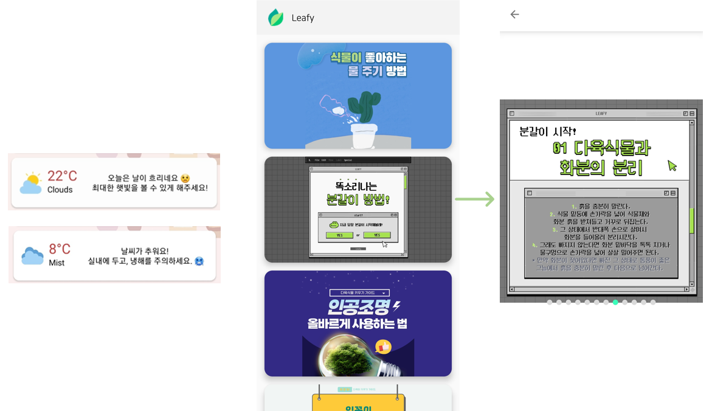
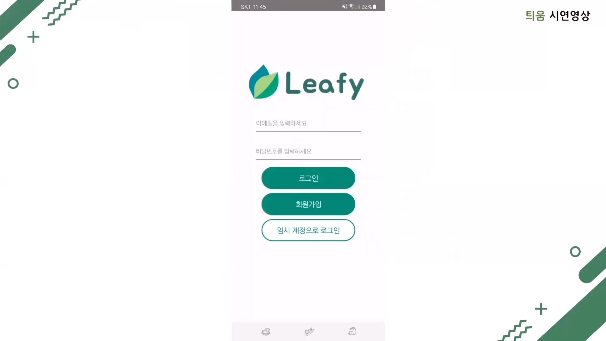
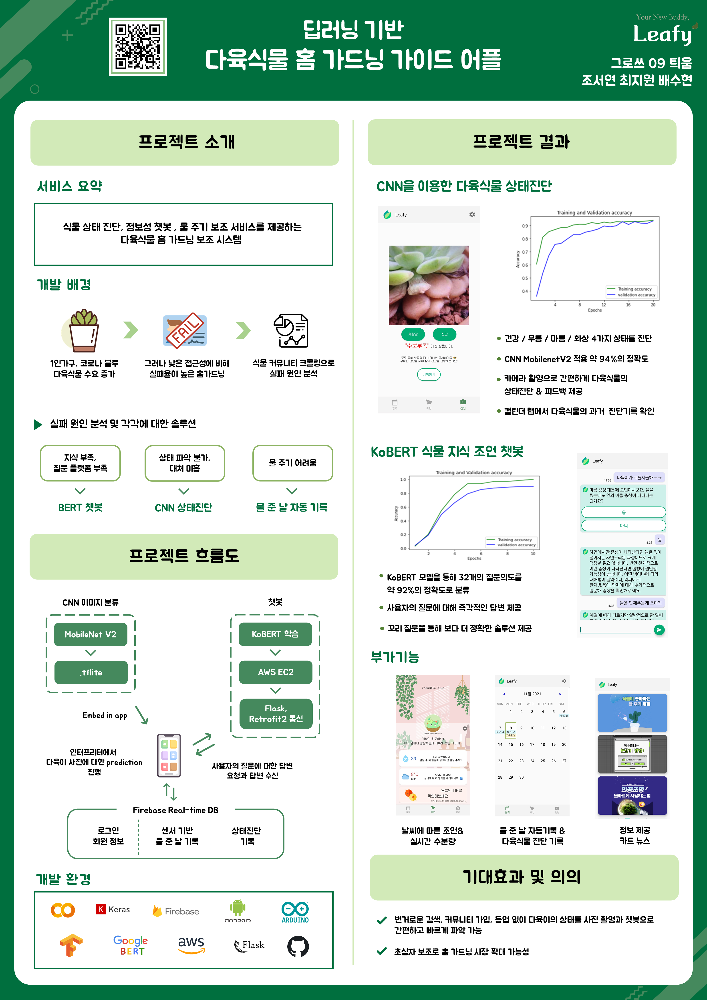

<h1 align="center">Leafy</h1>

[2021 캡스톤 디자인 프로젝트] 딥러닝 기반 다육식물 홈 가드닝 가이드 앱: Leafy

- [서비스](#-cnn을-이용한-다육식물-상태진단)
  - [CNN을 이용한 다육식물 상태진단](#-cnn을-이용한-다육식물-상태진단)
  - [KoBERT 챗봇](#-kobert-챗봇)
  - [물 주기 도움](#-물-주기-도움)
  - [부가 기능](#부가-기능)
- [제품설명서](./product_guide.pdf)
- [시연 영상](#시연-영상)
- [포스터](#포스터)

---

## 📷 CNN을 이용한 다육식물 상태진단

- CNN MobileNetV2

- 카메라 촬영으로 간편하게 다육식물의 상태진단 & 피드백 제공

- '기록하기' 후 캘린더 탭에서 다육식물의 과거 진단 기록 확인 가능

- [ 건강 / 과습 / 수분부족 / 화상 ] 4가지 상태를 진단

   

## 💬 KoBERT 챗봇

- KoBERT 학습으로 32개 질문 의도 분류
- 사용자의 질문에 대해 즉각적인 답변 제공
- 꼬리 질문을 통해 더 정확한 솔루션 제공

 

## 💧 물 주기 도움 

- 아두이노 토양수분센서와 블루투스 모듈 HC-06 사용
- 메인 화면에서 실시간 토양 수분량 확인
- 수분량이 급격히 증가하는 순간을 인식해 물 준 날 자동 기록

 

## ✨부가 기능

- 메인 화면에 현재 날씨에 따른 조언 제공
- 정보성 카드 뉴스

 

## 시연 영상

 

## 포스터

